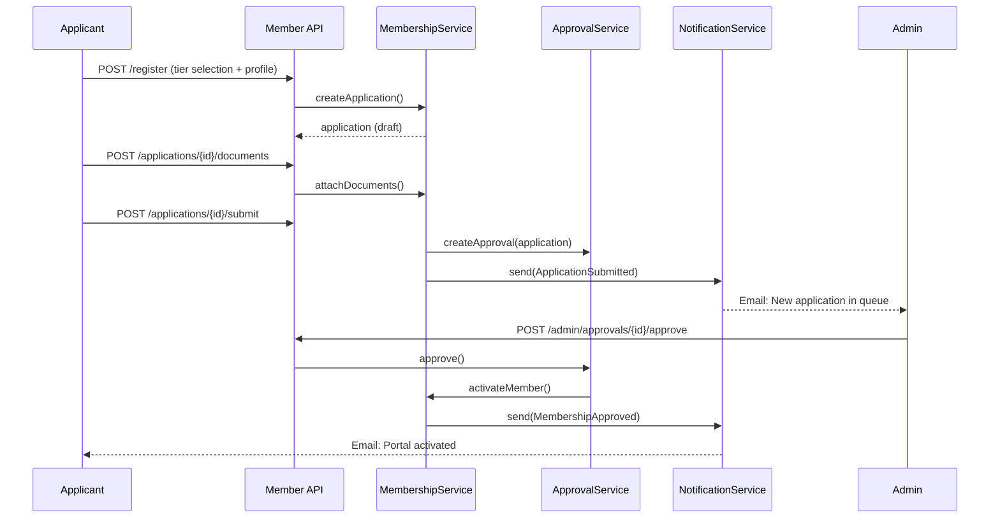
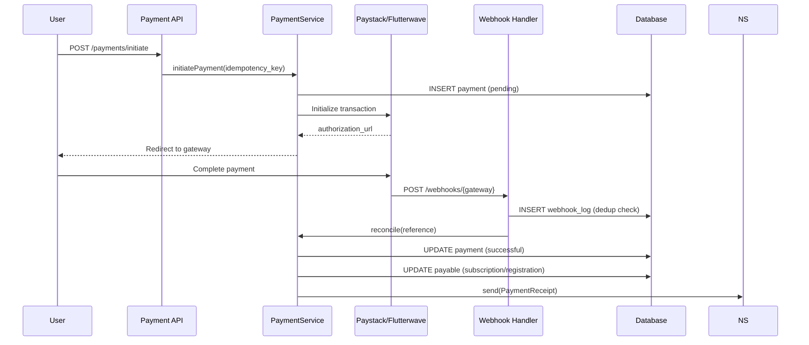
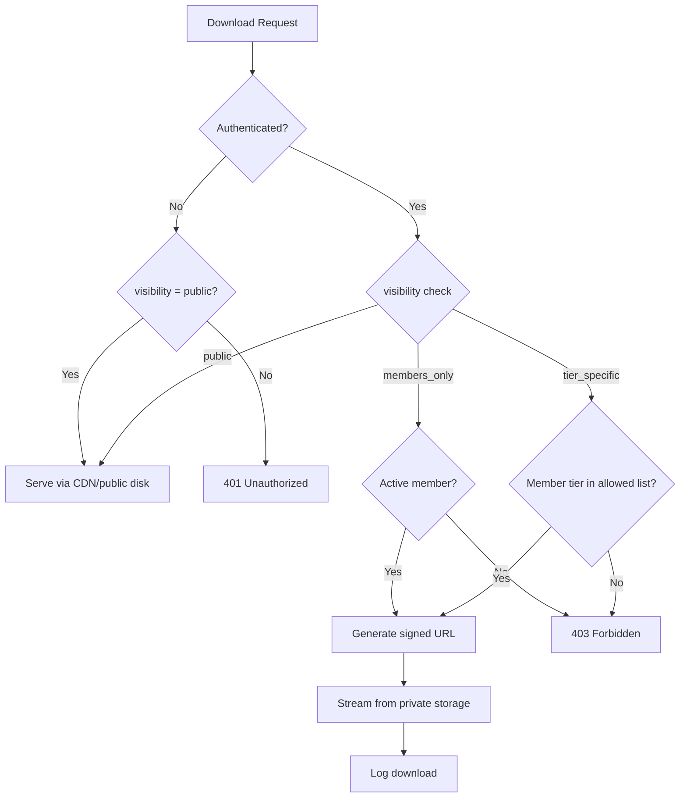

# Phase 1: Enterprise Association Management Platform — System Architecture

## 1. Executive Summary

This document defines the production architecture for **Jocrams**, an Enterprise Association Management Platform built on **Laravel 13** with a modular monolith pattern. The system serves three primary audiences through distinct route guards and authorization layers:

| Surface | Audience | Auth Guard | Primary Concerns |
|---------|----------|------------|------------------|
| Public Corporate CMS | Anonymous visitors | `web` (guest) | SEO, content discovery, public downloads |
| Membership Portal | Registered members | `member` (Sanctum + session) | Self-service, credentials, payments |
| Admin & Ops Hub | Staff & administrators | `admin` (Sanctum + session) | RBAC, approvals, reporting, broadcasts |

---

## 2. Module Breakdown

```
app/
├── Domain/
│   ├── Auth/              # Multi-guard authentication, RBAC enforcement
│   ├── Membership/        # Tiers, applications, lifecycle, credentials
│   ├── Payments/          # Paystack/Flutterwave, webhooks, subscriptions
│   ├── Events/              # Event CRUD, registrations, ticketing
│   ├── Content/             # News, pages, categories, tags
│   ├── Library/             # Downloads, media files, signed URL access
│   ├── Communications/      # Email/SMS templates, bulk campaigns
│   ├── Directory/           # Branches, contact inquiries
│   └── Admin/               # Exports, audit logs, batch operations
├── Http/
│   ├── Controllers/
│   │   ├── Api/V1/Public/
│   │   ├── Api/V1/Member/
│   │   └── Api/V1/Admin/
│   ├── Middleware/
│   │   ├── EnsureMemberIsActive.php
│   │   ├── EnsureUserHasPermission.php
│   │   └── EnforceContentVisibility.php
│   └── Requests/            # Form request validation per domain
├── Services/                # Application services (orchestration)
├── Repositories/            # Data access abstraction (optional per domain)
├── Jobs/                    # Async: webhooks, bulk SMS, PDF generation
├── Events/                  # Domain events
├── Listeners/               # Event handlers
├── Notifications/           # Transactional notifications
└── Policies/                # Authorization policies per model
```

### 2.1 Domain Modules

#### Auth & RBAC
- Multi-guard authentication (`admin`, `member`, `web`)
- Role-permission matrix with guard-scoped permissions
- Middleware pipeline for route-level enforcement
- Activity audit logging for admin actions

#### Membership
- Multi-tier membership with configurable dues and approval requirements
- Application workflow: `draft → submitted → under_review → approved|rejected`
- Member profile with status lifecycle: `pending → active → expired|suspended`
- Digital credential issuance (cards & certificates) with QR verification tokens

#### Payments
- Unified payment abstraction over Paystack and Flutterwave
- Idempotent payment initiation with `idempotency_key`
- Webhook reconciliation with deduplication via `payment_webhook_logs`
- Polymorphic `payable` linkage (subscriptions, event registrations, donations)

#### Content & Library
- News/blog with categories, tags, and visibility scoping
- Digital library with `public`, `members_only`, and `tier_specific` access
- Signed URL generation for private asset streaming

#### Events
- Event publishing with registration windows and capacity limits
- Registration linked to payments for paid events
- Check-in tracking for attendance

#### Communications
- Template-driven transactional notifications
- Queue-based bulk messaging with audience filters
- Delivery logging and failure retry

#### Admin & Ops
- Approval queues (membership applications, content moderation)
- CSV/Excel export pipelines
- Batch operations with audit trail

---

## 3. Service Layer Architecture

```
┌─────────────────────────────────────────────────────────────────┐
│                     HTTP Layer (Controllers)                     │
│         Public API  │  Member API  │  Admin API                  │
└──────────┬──────────────────┬──────────────────┬────────────────┘
           │                  │                  │
┌──────────▼──────────────────▼──────────────────▼────────────────┐
│                    Middleware Pipeline                             │
│  auth:admin|member  →  permission:*  →  visibility:*  →  throttle  │
└──────────┬──────────────────┬──────────────────┬────────────────┘
           │                  │                  │
┌──────────▼──────────────────▼──────────────────▼────────────────┐
│                   Application Services                             │
│  MembershipService  PaymentService  CredentialService              │
│  ContentService     NotificationService  ExportService             │
└──────────┬──────────────────┬──────────────────┬────────────────┘
           │                  │                  │
┌──────────▼──────────────────▼──────────────────▼────────────────┐
│              Domain Models + Repository Layer                      │
│  Eloquent models with scopes, casts, relationships, policies       │
└──────────┬──────────────────┬──────────────────┬────────────────┘
           │                  │                  │
┌──────────▼──────────────────▼──────────────────▼────────────────┐
│         Infrastructure (DB, Redis, S3, Queue, Mail, SMS)        │
└─────────────────────────────────────────────────────────────────┘
```

### 3.1 Key Service Contracts

| Service | Responsibility |
|---------|---------------|
| `AuthService` | Login, token issuance, guard resolution, password reset |
| `MembershipApplicationService` | Registration flow, document upload, status transitions |
| `ApprovalService` | Polymorphic approval queue processing |
| `PaymentGatewayService` | Gateway abstraction, initiate, verify, refund |
| `WebhookReconciliationService` | Idempotent webhook processing |
| `CredentialGenerationService` | PDF/image generation, QR embedding, verification |
| `SignedUrlService` | Temporary signed URLs for private downloads |
| `BulkMessagingService` | Audience resolution, chunked dispatch |
| `ExportService` | Filtered member/transaction CSV/Excel generation |

---

## 4. Data Flow Diagrams

### 4.1 Membership Onboarding Flow



### 4.2 Payment & Webhook Reconciliation Flow



### 4.3 Role-Gated Download Access



---

## 5. Security Architecture

### 5.1 Authentication Guards

| Guard | Driver | Use Case | Token TTL |
|-------|--------|----------|-----------|
| `web` | session | Public site browsing | Session lifetime |
| `member` | sanctum | Member portal API + SPA | 7 days (refreshable) |
| `admin` | sanctum | Admin panel API | 8 hours (refreshable) |

Configuration in `config/auth.php`:

```php
'guards' => [
    'web'    => ['driver' => 'session', 'provider' => 'users'],
    'member' => ['driver' => 'sanctum', 'provider' => 'users'],
    'admin'  => ['driver' => 'sanctum', 'provider' => 'users'],
],
```

### 5.2 RBAC Permission Model

Permissions follow `{module}.{action}` naming:

```
members.view, members.create, members.approve, members.export
payments.view, payments.refund, payments.override
content.news.publish, content.downloads.manage
events.manage, events.registrations.view
communications.broadcast, communications.templates.manage
admin.roles.manage, admin.audit.view
```

**Enforcement layers:**
1. **Route middleware** — `permission:members.approve` on admin routes
2. **Policy classes** — Model-level authorization (e.g., `MemberPolicy@update`)
3. **Query scopes** — Data-level filtering (members see only own records)
4. **Visibility middleware** — Content access based on `visibility` enum

### 5.3 Route Access Matrix

| Route Prefix | Guard | Middleware Stack |
|-------------|-------|------------------|
| `/api/v1/public/*` | none | `throttle:public` |
| `/api/v1/member/*` | `member` | `auth:member`, `member.active`, `throttle:member` |
| `/api/v1/admin/*` | `admin` | `auth:admin`, `permission:*`, `throttle:admin` |
| `/verify/{token}` | none | `throttle:verify` (credential verification) |
| `/webhooks/*` | none | `verify.webhook.signature` |

### 5.4 Additional Security Controls

- **Password hashing**: bcrypt (rounds=12)
- **Webhook verification**: HMAC signature validation per gateway
- **Idempotency**: Unique `idempotency_key` on payments prevents duplicate charges
- **Signed URLs**: 15-minute TTL for private file downloads
- **Rate limiting**: Tiered throttling per guard
- **Audit trail**: All admin mutations logged to `activity_logs`
- **Soft deletes**: Recoverable deletion on core entities
- **PII encryption**: Sensitive fields encrypted at rest (Phase 2)
- **CORS**: Restricted to known frontend origins

---

## 6. Database Schema Overview

### 6.1 Entity Relationship Summary

```
users ──┬── user_role ── roles ── role_permission ── permissions
        ├── members ── membership_tiers
        │     ├── subscriptions ── payments
        │     ├── digital_credentials
        │     └── membership_applications ── application_documents
        ├── event_registrations ── events
        ├── payments (polymorphic payable)
        └── activity_logs

categories ── news_articles ── taggables ── tags
categories ── downloads ── media_files
categories ── events

branches ── contact_inquiries
notification_templates ── notification_logs
bulk_campaigns ── bulk_campaign_recipients
approvals (polymorphic: applications, content, etc.)
payment_webhook_logs
donations ── payments
```

### 6.2 Core Tables

| Table | Purpose | Soft Delete |
|-------|---------|-------------|
| `users` | Authentication identity | Yes |
| `roles`, `permissions` | RBAC | No |
| `membership_tiers` | Tier definitions & dues | Yes |
| `members` | Active member profiles | Yes |
| `membership_applications` | Onboarding workflow | Yes |
| `approvals` | Polymorphic approval queue | No |
| `payments`, `transactions` | Payment records | Yes (payments) |
| `subscriptions` | Membership dues periods | Yes |
| `events`, `event_registrations` | Event management | Yes |
| `news_articles`, `categories`, `tags` | CMS content | Yes (articles) |
| `downloads`, `media_files` | Digital library | Yes |
| `digital_credentials` | Cards & certificates | Yes |
| `notification_templates`, `bulk_campaigns` | Communications | Yes (campaigns) |
| `activity_logs` | Audit trail | No |
| `branches`, `contact_inquiries` | Directory | Yes (branches) |
| `donations` | Donation records | No |
| `pages` | Static CMS pages | Yes |

### 6.3 Indexing Strategy

- **Unique indexes**: `users.email`, `members.membership_number`, `payments.reference`, `payments.idempotency_key`, `digital_credentials.verification_token`
- **Composite indexes**: `(status, created_at)` on approvals, applications, payments for queue queries
- **Foreign key indexes**: All `foreignId` columns indexed automatically
- **Search indexes**: `slug` columns on content tables for URL resolution
- **Partial indexes** (PostgreSQL): Active members `WHERE status = 'active'` (Phase 5 optimization)

---

## 7. API Versioning & Route Structure

```
/api/v1/
├── public/
│   ├── news/
│   ├── events/
│   ├── downloads/
│   ├── branches/
│   ├── contact/
│   └── verify/{token}
├── member/
│   ├── auth/
│   ├── profile/
│   ├── applications/
│   ├── payments/
│   ├── credentials/
│   ├── events/
│   └── downloads/
├── admin/
│   ├── members/
│   ├── approvals/
│   ├── payments/
│   ├── content/
│   ├── events/
│   ├── communications/
│   ├── exports/
│   └── settings/
└── webhooks/
    ├── paystack
    └── flutterwave
```

---

## 8. Technology Stack

| Layer | Technology |
|-------|-----------|
| Framework | Laravel 13 (PHP 8.3+) |
| Database | PostgreSQL (production), SQLite (dev) |
| Cache/Queue | Redis |
| File Storage | S3-compatible (production), local (dev) |
| PDF Generation | DomPDF / Snappy (Phase 2) |
| QR Codes | SimpleSoftwareIO/simple-qrcode (Phase 2) |
| Payments | Paystack SDK, Flutterwave SDK (Phase 2) |
| Email | Laravel Mail + queue |
| SMS | Termii / Africa's Talking (Phase 3) |
| Frontend | Inertia.js + Vue 3 / React (Phase 4) |
| CI/CD | GitHub Actions (Phase 5) |
| Containers | Docker + Docker Compose (Phase 5) |

---

## 9. Phase 1 Deliverables Checklist

- [x] Module breakdown and service layer design
- [x] Security architecture (guards, RBAC, middleware)
- [x] Data flow diagrams (onboarding, payments, downloads)
- [x] Production-ready database migrations
- [x] Indexing and foreign key constraints
- [x] Soft delete support on appropriate entities

**Next Phase (Phase 2):** Implement authentication engine, membership workflow, payment gateways, credential generation, and signed URL download engine.
